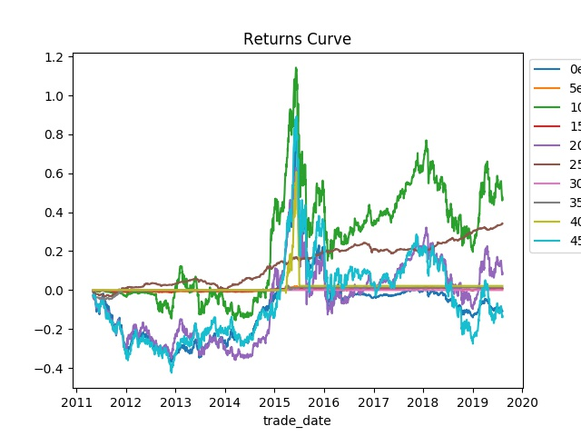
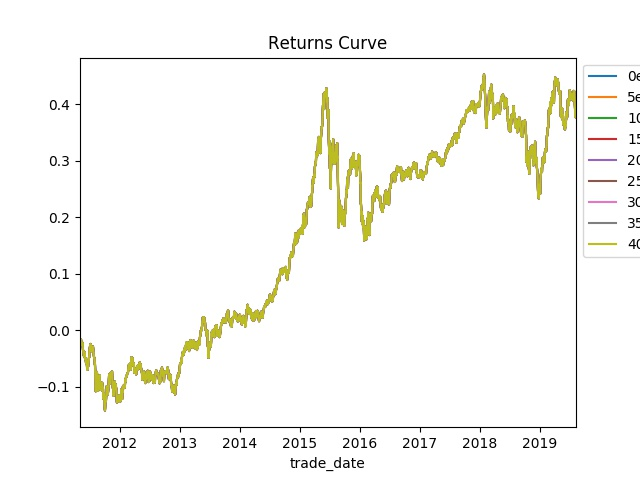

# 资产配置策略

这是一个资产配置策略的强化学习算法，意在通过基本面数据生成资产配置权重，从而为投资者调仓提供建议。


## 特征

本算法主要针对A股市场，把上证综指、沪深300、中证500、恒生指数、标普500、中债总财富指数作为配置方向，
然后根据上述大盘指数每日指标，如下：

|名称 | 类型 | 默认显示 | 描述 |
| ---- | ---- | ---- | ---- |
|ts_code | str | Y | TS代码 |
|trade_date | str | Y | 交易日期 |
|total_mv | float | Y | 当日总市值（元）|
|float_mv | float | Y | 当日流通市值（元）|
|total_share | float | Y | 当日总股本（股）|
|float_share | float | Y | 当日流通股本（股）|
|free_share | float | Y | 当日自由流通股本（股）|
|turnover_rate | float | Y | 换手率|
|turnover_rate_f | float | Y | 换手率(基于自由流通股本)|
|pe | float | Y | 市盈率|
|pe_ttm | float | Y | 市盈率TTM|
|pb | float | Y | 市净率|


然后根据上述指标构造特征：

| 特征构造方法 | 特征构造参数 | 针对的指标 | 说明 |
| ---- | ---- | ---- | ---- |
| MA | 7，21 | 所有指标 |  |
| EMA | 12，26 | 所有指标 |  |
| MACD |  | EMA12， EMA26 |  |
| 移动标准差 | win=20 |  |  |
| bollinger bands |  |  |  |
| EWM | com=0.5 |  |  |
| 傅立叶去燥 | 3，6，9，100 |  |  |
| 移动分位数 | 1年、2年、3年、5年 | 所有指标 |  |

## 算法

目前，测试了两种强化学习算法：Q_Learning 和 Pathwise-Derivative.

### Q-Learning

Q-Learning算法是对于多维连续行为强化学习的一种解决方法。

通过LSTM和全联接层，让神经网络输出一个向量$\mu,$ 一个矩阵$\Sigma,$ 和一个数值$\sigma.$

然后定义Q函数为：

$$ Q(a｜state_t) = (a - \mu)^T * \Sigma * \Sigma^T * (a - \mu) $$

表示如果在状态t时刻采用策略 a，t以后都采用该神经网络的提供的最优策略，那么当前状态t的reward的估值（或者说当前行为a的价值）。

下面是采用Q-Learning学习策略训练模型，测试结果如下： 



### Pathwise_Derivative

Pathwise Derivative 是Q-Learning 和 A2C 模型的结合。

需要两个神经网络：一个网络根据当前状态提供行为，一个网络对当前 状态该行为的价值进行评分（类似Q函数）。

这里为了是的网络更好地学习状态，对于LSTM层进行了共享。

下面是采用Pathwise_Derivative学习策略训练模型，测试结果如下：



Pathwise Derivative 的训练速度远远慢于Q-Learning，但是其结果更稳定。


# 环境

numpy>=1.18.0
torch==1.5.0+cpu
torchvision==0.6.0+cpu
gym==0.15.4
matplotlib==3.1.2
pandas>=0.25.3
scikit-learn==0.22.1
Pillow==6.2.2

# 训练方法

```Shell
python algorithm/Q_Learning_Explore.py 
```

```Shell
python algorithm/Pathwise_Derivative_UPDATE.py 
```

# 作者

[C.M. Cai](https://cmcai0104.github.io)